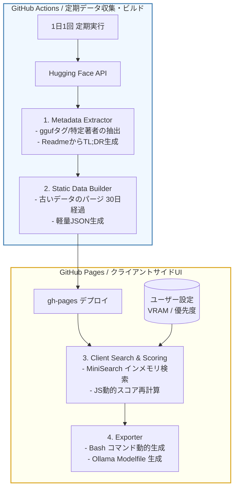

# 基本設計書（基本仕様・GitHub Pages完結型アーキテクチャ定義）

**ローカルLLM＆GGUF特化型 新着TL;DRフィード**

| 項目           | 内容                                                 |
| :------------- | :--------------------------------------------------- |
| 文書番号       | LLF-BD-001                                           |
| ドキュメント名 | ローカルLLM＆GGUF特化型 新着TL;DRフィード 基本設計書 |
| 版数           | Rev.1.0                                              |
| 作成日         | 2026-09-17                                           |

---

## 1. 概要と基本方針

### 1.1 システムの目的

日々膨大にリリースされるローカルLLM（特にGGUFフォーマット）の中から、ユーザーのハードウェア環境（VRAM容量）とユースケース（速度優先・精度優先）に最適なモデルをノイズレスに発見し、手元の実行環境へシームレスに導入するための静的フィードプラットフォームを提供する。

### 1.2 アーキテクチャ基本原則（分離派アーキテクチャ）

本システムは、保守性とポータビリティを高めるため、**「ファクト（事実）の収集層」と「解釈・評価（スコアリング）のプレゼンテーション層」を物理的に完全分離**する。

1. **バックエンド（GitHub Actions）の責務限定**:
   スコアの決定を行わず、Hugging Face APIから抽出した「パラメータ数」「量子化形式」「蒸留の有無」といった不変のファクトのみを抽出し、直近14〜30日分の極小JSONデータとしてビルド・静的配置する。

2. **フロントエンド（GitHub Pages）への委譲**:
   ブラウザ上のクライアントアプリケーションが、ユーザーの環境設定（VRAM 8GB〜32GB+）を読み込み、インメモリで動的に重み付け計算とソートを実行する。

3. **ゼロインフラ運用**:
   動的なデータベースやAPIサーバーを一切廃止し、GitHub ActionsとPagesのみで完結させることで、ランニングコストと運用保守の手間をゼロにする。

---

## 2. システム全体アーキテクチャとデータフロー



### 2.1 コンポーネント責務

| レイヤー | コンポーネント名     | 担当領域・主要責務                                                                       |
| :------- | :------------------- | :--------------------------------------------------------------------------------------- |
| 収集     | `HuggingFaceCrawler` | HF APIからの差分フェッチ（`.gguf`拡張子の走査、量子化フォーマットのリスト化）。           |
| 整形     | `FeedBuilder`        | 古いレコードの削除、TL;DRの付与、数MB以下の軽量 `models_feed.json` への圧縮。             |
| UI       | `DynamicScorerUI`    | `models_feed.json` を非同期ロードし、ユーザーのVRAM設定に基づく動的スコア計算・ソート・絞り込み。 |
| 出力     | `LocalEnvExporter`   | 選択されたモデルをローカルで実行するためのスクリプト（Bash/Python用変数）や設定ファイルを生成し、クリップボードへ出力。 |

---

## 3. データモデルとスコアリング仕様

### 3.1 配信データ構造（極小JSONスキーマ）

バックエンドが生成し、フロントエンドに配信する単一レコードの構造。最大35Bクラスまでのモデルを想定し、パラメータ数は浮動小数点（Float）で保持する。

```json
{
  "id": "bartowski/Command-R-35B-v0.1-GGUF",
  "base": "Command-R-35B",
  "date": "2026-09-17",
  "params_b": 35.0,
  "is_distilled": false,
  "quants": ["Q4_K_M", "Q5_K_M", "Q8_0"],
  "tldr": "高度なRAGとツール呼び出しに特化した35Bモデル。"
}
```

### 3.2 クライアントサイド動的スコアリングロジック

フロントエンドのJavaScriptにて、以下の要素を複合してTotal Scoreを算出し、降順ソートする。

1. **VRAMマッチング (Hardware Constraint)**
   - 例: VRAM 24GB設定時 → 30B〜35Bクラスのモデルに最大加算。8GB設定時はペナルティ（減算）。

2. **量子化フォーマット (Quantization Sweet Spot)**
   - `Q4_K_M` などの実用性の高いフォーマットが含まれている場合に一律加算。
   - 特大VRAM環境（32GB+）では `Q8_0` などの無劣化に近いフォーマットを優遇。

3. **アーキテクチャ特性 (Efficiency Bonus)**
   - `is_distilled`（蒸留モデル）が `true` の場合、「サイズ対性能比が高い」とみなし、ユーザーが「速度優先」を設定している場合にボーナスを加算。

---

## 4. エクスポート制御仕様 (Export to Local)

Web UI上で絞り込んだモデルを、手元のローカルLLM環境へ即座に統合するための出力を担う。

### 4.1 Bash / Python環境変数エクスポート

ローカルLLMを制御する独自のPythonヘルパースクリプトや、Bashによるファイル自動化処理へ渡すための環境変数・ダウンロードコマンドを生成する。ユーザーのVRAM設定に応じ、オフロードレイヤー数（例: `n_gpu_layers`）の初期値も動的に算出する。

### 4.2 Ollama Modelfile エクスポート

Ollama 向けのカスタムモデル定義ファイル（`Modelfile`）のテキスト文字列を動的構築し、Clipboard API を用いてワンクリックコピーを提供する。ベースモデルに応じた適切なプロンプトテンプレート（ChatML, Llama3フォーマット等）を自動補完する。

---

## 5. 改訂履歴 (Change Log)

| 版数    | 改訂日     | 変更者     | 変更内容・変更理由 (Why) |
| :------ | :--------- | :--------- | :----------------------- |
| Rev.1.0 | 2026-09-17 | 開発チーム | 新規作成（初版制定）     |
