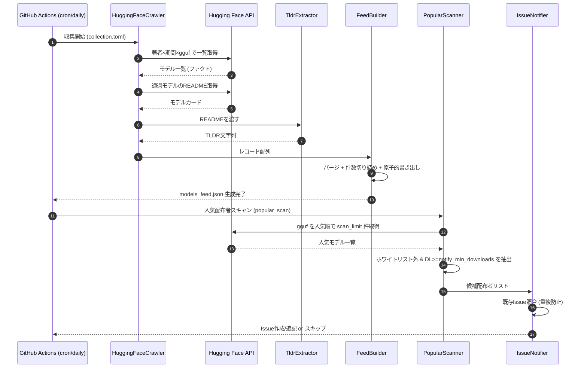
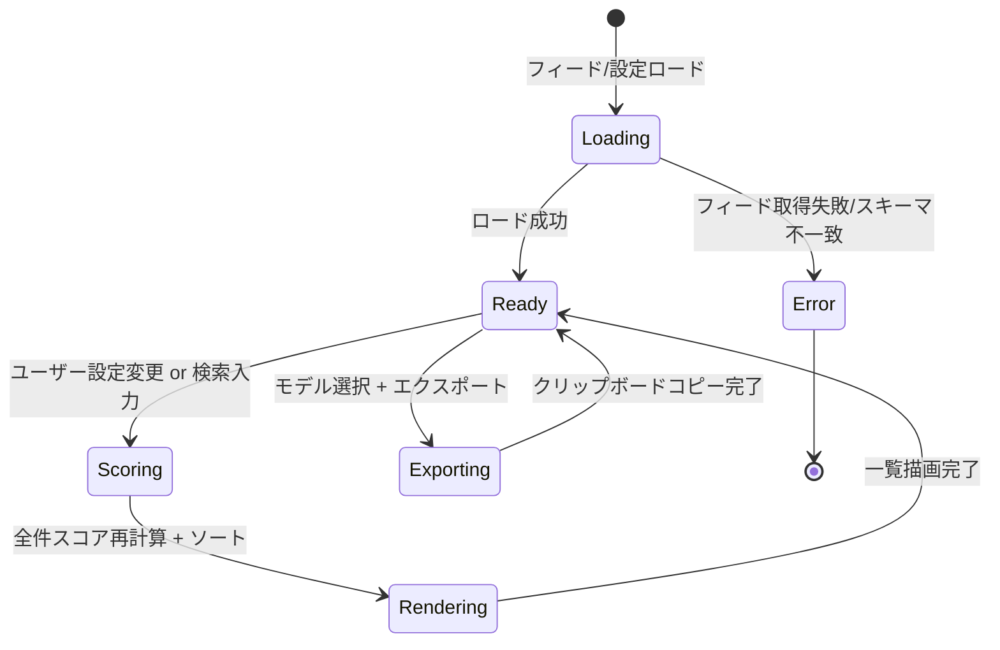

# 詳細設計書（機能・モジュール制御仕様）

**ローカルLLM＆GGUF特化型 新着TL;DRフィード / 収集パイプラインとクライアント制御**

| 項目           | 内容                                                 |
| :------------- | :--------------------------------------------------- |
| 文書番号       | LLF-DD-001                                           |
| ドキュメント名 | ローカルLLM＆GGUF特化型 新着TL;DRフィード 詳細設計書 |
| 版数           | Rev.1.0                                              |
| 作成日         | 2026-09-17                                           |

---

## 1. 概要とSSOT境界

### 1.1 モジュールの目的

本書は次の3系統の制御仕様を正本として規定する。

- **収集・整形パイプライン（バックエンド / Python）**: HF APIからファクトを抽出し `models_feed.json` を生成する。
- **人気配布者スキャンとIssue通知（バックエンド / Python + GitHub Actions）**: ホワイトリスト外の人気GGUF配布者を検出しIssue化する。
- **クライアント制御（フロント / JavaScript）**: フィードの検索・動的スコアリング・ソート・ローカル環境向けエクスポート。

### 1.2 単一責任範囲 (SSOT) とデータ境界

- **制御正本 (SSOT)**: 本書は処理順序・制御フロー・状態遷移・失敗契約の正本。
- **データ境界**: 永続化・配信データのスキーマは LLF-DS-001、スコアの配点数値は LLF-SC-001 を正本とする。

### 1.3 実行トリガーと頻度

- **定期実行**: 毎日1回。`cron: "0 21 * * *"`（UTC 21:00 = JST 翌06:00）。
- **手動実行**: `workflow_dispatch`。
- **push**: `main` への `config/**`・`public/**`・`src/**` 変更時に再ビルド・再デプロイ。

---

## 2. インターフェースと処理コンポーネント

### 2.1 コンポーネントと責務

| # | コンポーネント名     | 責務                                                                                     | 関連DS |
| :-- | :------------------- | :--------------------------------------------------------------------------------------- | :----- |
| 1 | `HuggingFaceCrawler` | `collection.toml` の著者・条件でHF APIを叩き、GGUFモデルのファクトを取得。                | §2.2, §2.3 |
| 2 | `TldrExtractor`      | READMEからルールベースでTL;DRを抽出（生成AI不使用）。                                     | §2.4 |
| 3 | `FeedBuilder`        | 収集結果のパージ・整形・件数切り詰めを行い `models_feed.json` を原子的に書き出す。        | LLF-DS-001 §2.2, §3.1 |
| 4 | `PopularScanner`     | gguf タグ全体を人気順で走査し、ホワイトリスト外の高DL配布者を検出。                       | LLF-DS-001 §2.5 |
| 5 | `IssueNotifier`      | 検出した候補配布者をGitHub Issueとして通知（重複防止付き）。                              | §3.3 |
| 6 | `ScoringConverter`   | `scoring.toml` を `public/data/scoring.json` へ変換（任意）。                             | LLF-DS-001 §2.4 |
| 7 | `ClientApp`          | フィード・スコア設定をロードし、検索・動的スコアリング・ソート・描画。                    | §4 |
| 8 | `LocalEnvExporter`   | 選択モデルのBash/環境変数・Ollama Modelfileを動的生成しクリップボードへ出力。             | §5 |

### 2.2 収集対象の抽出条件

収集は以下のAND条件で行う（LLF-DS-001 §2.3 の設定を使用）。

```
（author が collection.authors のいずれか）
AND （gguf タグ/拡張子を持つ ; gguf_only=true のとき）
AND （lastModified または作成日が today - retention_days 以内）
AND （downloads >= min_downloads）
```

- HF APIの一覧取得は著者ごとに `author` + 期間でフィルタし、返却件数を抑える。
- READMEの取得は上記フィルタ通過後のモデルに限定し、リクエスト数を `max_records` 相当に抑える。

### 2.3 ファクト抽出仕様

| 抽出項目       | 抽出元                                          | 補足                                                       |
| :------------- | :---------------------------------------------- | :--------------------------------------------------------- |
| `id`           | HF repo id                                      | `author/repo`。                                            |
| `author`       | repo id の接頭辞                                | ホワイトリスト照合キー。                                   |
| `base`         | モデル名・カードメタ・タグ                      | バージョン接尾辞や量子化接尾辞を除去して正規化。           |
| `params_b`     | モデル名の `NB` 表記、safetensors/config 情報   | 例 `35B` → `35.0`。抽出不能時は名前からの推定、無理なら除外候補。 |
| `is_distilled` | モデル名・タグの `distill` 等の語               | 語が含まれれば `true`。                                    |
| `quants`       | リポジトリ内のGGUFファイル名                    | `Q4_K_M` 等の量子化サフィックスを列挙・重複排除。          |
| `downloads`    | HF API の downloads                             | 下限フィルタと参考表示に使用。                             |
| `date`         | 収集実行日または lastModified                   | `YYYY-MM-DD`。                                             |

### 2.4 TL;DR抽出ルール（生成AI不使用）

以下を上から順に試し、最初に取得できたものを1〜2文（最大200文字目安）に整形して採用する。取得不能なら空文字。

1. モデルカード（README）先頭の見出し直後の最初の段落。
2. `## Description` / `## Overview` / `# Summary` 等の代表見出し配下の先頭段落。
3. HFカードのメタ（`model-index` の説明やタグ）から生成する定型文。

整形時、Markdown記法・バッジ・画像・過剰な空白を除去する。

---

## 3. バックエンド処理フロー・失敗契約

### 3.1 パイプライン全体フロー (Sequence)



### 3.2 状態遷移・分岐ルール

| 現在の状態         | 評価                                   | 次の状態          | 判定条件                                       |
| :----------------- | :------------------------------------- | :---------------- | :--------------------------------------------- |
| 収集開始           | HF一覧取得成功                         | ファクト抽出      | HTTP 200 かつ配列取得                          |
| 収集開始           | HF一覧取得失敗                         | 失敗終了          | リトライ上限到達（§3.4）                       |
| ファクト抽出       | `params_b` 抽出不能                    | 当該レコード除外  | 名前・メタから推定不可                         |
| フィード生成       | 生成成功                               | スキャンへ        | 原子的置換完了                                 |
| スキャン           | `popular_scan.enabled=false`           | 通知スキップ      | 設定で無効                                     |
| スキャン           | 候補あり                               | Issue通知         | ホワイトリスト外 かつ DL>=notify閾値           |
| Issue通知          | 同名Issueが既存 (open)                 | 追記 or スキップ  | §3.3 の重複防止                                |

### 3.3 Issue通知仕様（重複防止）

- **権限**: GitHub Actions の `GITHUB_TOKEN` に `issues: write` を付与する。
- **作成方式**: `actions/github-script` または REST API でIssueを作成する。
- **重複防止**:
  1. 固定ラベル（例 `gguf-candidate-author`）でopen Issueを検索。
  2. 同じ配布者名が既存Issue本文に含まれる場合は新規作成せずスキップ（または既存Issueにコメント追記）。
  3. 1回の実行で複数候補があっても、単一のIssue（当日分）に集約して乱立を防ぐ。
- **Issue本文**: 候補配布者名・DL数・代表モデルへのリンク・`collection.toml` への追加手順を記載。

### 3.4 エラー処理・失敗契約

| エラーカテゴリ       | 判定基準                          | 再試行上限 | 終端ステータス | 副作用・データ保持契約                                   |
| :------------------- | :-------------------------------- | :--------: | :------------- | :------------------------------------------------------- |
| HF API 一時障害      | HTTP 5xx / タイムアウト           | 3回        | 失敗終了       | 既存 `models_feed.json` は変更しない（前回分を維持）。   |
| HF レート制限        | HTTP 429                          | 指数backoff 最大3回 | 失敗終了 | 既存フィード維持。次回実行で再取得。                     |
| 個別README取得失敗   | 当該モデルのみ 4xx/5xx            | 1回        | 当該除外で継続 | TL;DR空でレコード採用、または当該除外。全体は継続。      |
| フィード書き出し失敗 | 一時ファイル/置換の例外           | 0回        | 失敗終了       | 原子的置換前のため正本は無傷（LLF-DS-001 §3.1）。        |
| Issue通知失敗        | Issues API 4xx/5xx                | 1回        | 警告で継続     | フィード生成は成功済み。通知のみログ警告。               |

- フィード生成が失敗した場合でも、直近の正本 `models_feed.json` は破壊しない（非破壊契約）。

---

## 4. フロントエンド制御（検索・動的スコアリング）

### 4.1 初期化と状態

- `public/data/models_feed.json` と スコア設定（`scoring.json` またはハードコード既定値, LLF-SC-001）を非同期ロード。
- ユーザー設定（VRAM区分・優先度: 速度/精度）は `localStorage` に保持し、次回起動時に復元。

### 4.2 検索とスコアリングの流れ (State)



- **検索**: MiniSearch でインメモリ全文検索（`id`/`base`/`tldr`/`quants` 等）。
- **スコアリング**: LLF-SC-001 の配点で各レコードの Total Score を算出し降順ソート。ユーザー設定変更のたびに再計算（インメモリ、DBなし）。
- **フィルタ**: VRAM区分・量子化有無・蒸留などで絞り込み。

### 4.3 UI構成

- 基本設計 §2 のMermaidどおりのSPA。左サイドにVRAM/優先度設定とフィルタ、右に結果カード一覧。
- `public/style.css`（旧プロジェクトから流用のスクロールバー等）を土台に、GGUF向けUIを再構築。
- MiniSearch・スタイルはCDNまたはvendored。ビルド工程は持たない（ゼロインフラ方針）。

---

## 5. エクスポート制御仕様

### 5.1 Bash / 環境変数エクスポート

- 選択モデルのGGUFダウンロードコマンド（`huggingface-cli download` 等）と、実行時パラメータの環境変数を生成。
- `n_gpu_layers` 初期値はフロントJSの軽量式で算出（LLF-SC-001 §のオフロード算出式）。四則演算のみでActions負荷なし。

### 5.2 Ollama Modelfile エクスポート

- `FROM <gguf>` を含む Modelfile 文字列を動的構築し、Clipboard API でワンクリックコピー。
- ベースモデル名から プロンプトテンプレート（ChatML / Llama3 等）を正規表現マッチで判定し、`TEMPLATE` を自動補完。判定不能時は汎用テンプレートにフォールバック。

### 5.3 テンプレート判定ルール（例）

| ベースモデル名パターン（正規表現, 大小無視） | 採用テンプレート |
| :------------------------------------------- | :--------------- |
| `llama-?3`                                   | Llama3           |
| `qwen`                                       | ChatML           |
| `command-?r`                                 | ChatML           |
| `mistral` / `mixtral`                        | Mistral          |
| 上記いずれも不一致                           | 汎用（フォールバック） |

---

## 6. テスト・検証要件

- **バックエンド**: ファクト抽出（`params_b`/`quants`/`is_distilled`）とTL;DR抽出の単体テスト。パージ・件数切り詰め・原子的書き出しの検証。HF APIはモック化。
- **フロント**: スコアリング関数と `n_gpu_layers` 算出式の単体テスト（純関数として切り出す）。
- **品質ゲート**: 既存 `ci.yml` に準拠し、ruff/mypy/pytest 全通過を条件とする（実装フェーズで新パッケージに合わせ更新）。

---

## 7. 改訂履歴 (Change Log)

| 版数    | 改訂日     | 変更者     | 変更内容・変更理由 (Why) |
| :------ | :--------- | :--------- | :----------------------- |
| Rev.1.0 | 2026-09-17 | 開発チーム | 新規作成（初版制定）     |