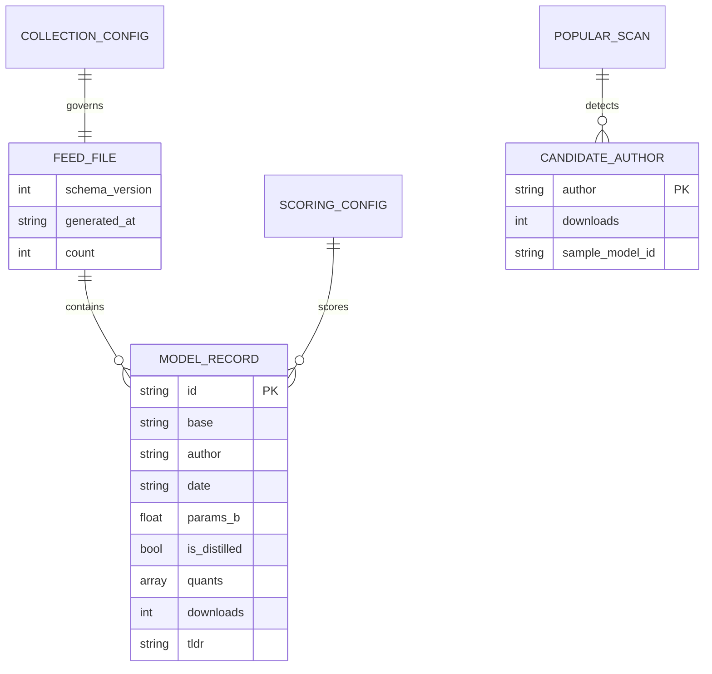

# データ構造・状態設計書（スキーマ・永続化・状態定義）

**ローカルLLM＆GGUF特化型 新着TL;DRフィード / 配信データと設定スキーマ**

| 項目           | 内容                                                       |
| :------------- | :--------------------------------------------------------- |
| 文書番号       | LLF-DS-001                                                 |
| ドキュメント名 | ローカルLLM＆GGUF特化型 新着TL;DRフィード データ構造仕様書 |
| 版数           | Rev.1.0                                                    |
| 作成日         | 2026-09-17                                                 |

---

## 1. 概要とデータ管理方針

### 1.1 管理対象データの目的

本書は、以下3系統のデータ構造を正本として規定する。

1. **配信データ（フィード）**: バックエンドが生成し `public/data/` へ静的配置、フロントエンドが非同期ロードする単一JSON（`models_feed.json`）。
2. **設定データ（config）**: 収集条件を定義する `config/collection.toml` と、スコアリング配点を定義する `config/scoring.toml`。
3. **副次生成物**: ホワイトリスト外の人気配布者を通知するために利用する検出結果（GitHub Issue化に用いる中間データ）。

### 1.2 データ境界（収集層 / プレゼンテーション層の分離）

基本設計書（LLF-BD-001 §1.2）の分離原則に従い、データの生成者と消費者を明確に分ける。

- **バックエンド（Python / GitHub Actions）**: `collection.toml` を読み、HF APIからファクトを抽出し `models_feed.json` を書き出す。スコアの値は持たせない。
- **フロントエンド（JavaScript / GitHub Pages）**: `models_feed.json` と `scoring.toml`（またはそのJSON化）を読み、ブラウザ上で動的にスコア計算・ソート・エクスポートを行う。

### 1.3 ファイル配置および階層構造

```
LocalLLM-Feed/
├── config/
│   ├── collection.toml      # 収集条件（バックエンドが読む）
│   └── scoring.toml         # スコアリング配点（フロントが読む）
├── public/
│   ├── index.html
│   ├── app.js
│   ├── style.css
│   └── data/
│       ├── models_feed.json    # 配信フィード（バックエンド生成）
│       └── scoring.json        # scoring.toml のJSON化（ビルド時生成・任意）
└── src/<package>/           # 収集・整形パイプライン（実装フェーズで作成）
```

- **配信フィード正本**: `public/data/models_feed.json`。バックエンドのビルドで全量上書き生成する。
- **スコアリング設定の配信**: フロントはTOMLを直接パースしない前提とし、ビルド時に `scoring.toml` → `public/data/scoring.json` へ変換して配信する（変換は §3.1 の原子置換契約に従う）。

---

## 2. データ構造およびスキーマ定義

### 2.1 エンティティ関係・データモデル構造 (Mermaid ER図)



### 2.2 配信フィード（models_feed.json）スキーマ

フィードファイルはメタ情報と単一レコード配列を持つオブジェクトとする。

```json
{
  "schema_version": 1,
  "generated_at": "2026-09-17T21:00:00Z",
  "count": 2,
  "models": [
    {
      "id": "bartowski/Command-R-35B-v0.1-GGUF",
      "base": "Command-R-35B",
      "author": "bartowski",
      "date": "2026-09-17",
      "params_b": 35.0,
      "is_distilled": false,
      "quants": ["Q4_K_M", "Q5_K_M", "Q8_0"],
      "downloads": 1240,
      "tldr": "高度なRAGとツール呼び出しに特化した35Bモデル。"
    }
  ]
}
```

#### フィードトップレベル

| フィールド名     | データ型 | 必須性 | デフォルト値 | フィールドの意味・制約条件                           |
| :--------------- | :------- | :----: | :----------- | :--------------------------------------------------- |
| `schema_version` | 数値     |  必須  | `1`          | スキーマ版数。破壊的変更時にインクリメント。         |
| `generated_at`   | 文字列   |  必須  | —            | 生成時刻（ISO 8601 UTC）。フロントの鮮度表示に使用。 |
| `count`          | 数値     |  必須  | —            | `models` の要素数。整合性チェック用。                |
| `models`         | 配列     |  必須  | `[]`         | モデルレコード（下表）の配列。日付降順で格納する。   |

#### モデルレコード（models[]）

| フィールド名   | データ型   | 必須性 | デフォルト値 | フィールドの意味・制約条件                                              |
| :------------- | :--------- | :----: | :----------- | :---------------------------------------------------------------------- |
| `id`           | 文字列     |  必須  | —            | HFのリポジトリID（`author/repo`）。一意キー。                           |
| `base`         | 文字列     |  必須  | —            | ベースモデル名。プロンプトテンプレート判定に使用。                      |
| `author`       | 文字列     |  必須  | —            | 配布元アカウント名。ホワイトリスト照合に使用。                          |
| `date`         | 文字列     |  必須  | —            | 収集対象日（`YYYY-MM-DD`）。保持期間パージ判定に使用。                  |
| `params_b`     | 数値       |  必須  | —            | パラメータ数（十億単位, Float）。最大35B級を想定。VRAMマッチングに使用。|
| `is_distilled` | ブーリアン |  必須  | `false`      | 蒸留モデルか。効率ボーナス判定に使用。                                  |
| `quants`       | 配列       |  必須  | `[]`         | 量子化フォーマット文字列の配列（例 `Q4_K_M`）。原則1件以上。            |
| `downloads`    | 数値       |  任意  | `0`          | HFのDL数。収集時の下限フィルタおよび参考表示に使用。                    |
| `tldr`         | 文字列     |  任意  | `""`         | READMEから抽出した1〜2文の要約（生成AI不使用）。抽出不能時は空文字。    |

### 2.3 収集設定（config/collection.toml）スキーマ

バックエンド（Python）が読み込む。値の変更はコード変更不要とする。

```toml
schema_version = 1

[collection]
retention_days = 30       # フィード保持期間（日）。この日数を超えたレコードはパージ
max_records = 300         # models_feed.json に載せる最大件数
min_downloads = 50        # 収集対象に含めるDL数の下限
gguf_only = true          # gguf タグ/拡張子を持つものだけを対象にする
tldr_fetch_limit = 120    # README を取得して TL;DR を付与する上位件数（負荷制御）

# 収集対象の信頼著者ホワイトリスト
authors = [
  "bartowski",
  "mradermacher",
  "TheBloke",
  "lmstudio-community",
  "Qwen",
]

[popular_scan]
enabled = true               # ホワイトリスト外の人気配布者検出を行うか
notify_min_downloads = 1000  # 通知対象とするDL数の下限
scan_limit = 100             # gguf タグ全体を人気順で走査する上位件数
```

| フィールド名                        | データ型   | 必須性 | デフォルト値 | 制約・意味                                              |
| :---------------------------------- | :--------- | :----: | :----------- | :------------------------------------------------------ |
| `schema_version`                    | 数値       |  必須  | `1`          | 設定スキーマ版数。                                      |
| `collection.retention_days`         | 数値       |  必須  | `30`         | 1以上。保持期間（既定30日）。                           |
| `collection.max_records`            | 数値       |  必須  | `300`        | 1以上。Actions負荷・配信サイズの上限制御。              |
| `collection.min_downloads`          | 数値       |  必須  | `50`         | 0以上。ホワイトリスト内でもこの値未満は除外。           |
| `collection.gguf_only`              | ブーリアン |  必須  | `true`       | GGUF以外を除外するフラグ。                              |
| `collection.tldr_fetch_limit`       | 数値       |  任意  | `120`        | 0以上。README を取得し TL;DR を付与する上位件数。0で無効。 |
| `collection.authors`                | 配列       |  必須  | 上記5件      | HFアカウント名の文字列配列。追加・削除で収集対象を調整。|
| `popular_scan.enabled`              | ブーリアン |  任意  | `true`       | ホワイトリスト外人気配布者の検出可否。                  |
| `popular_scan.notify_min_downloads` | 数値       |  任意  | `1000`       | 通知対象のDL下限。                                      |
| `popular_scan.scan_limit`           | 数値       |  任意  | `100`        | 人気順走査の上位件数。                                  |

### 2.4 スコアリング設定（config/scoring.toml）

スコアリングの配点・区分の詳細な数値定義は **LLF-SC-001 スコアリング設定仕様書** を正本とする。本書ではフロントが消費する構造上の位置づけのみ規定する。

- バックエンドのビルドで `scoring.toml` を `public/data/scoring.json` に変換して配信してよい（フロントでのTOMLパーサ依存を避けるため）。
- 変換しない場合はフロントに既定値をハードコードし、`scoring.toml` を「実装が参照する初期値仕様」として扱う（LLF-SC-001 で規定）。

### 2.5 人気配布者候補（popular scan 検出結果）

Issue通知（LLF-DD-001 通知フロー）に用いる中間データ。ファイルとして永続化するかはバックエンド実装の任意とし、最低限このフィールドを保持する。

| フィールド名      | データ型 | 必須性 | 意味                                            |
| :---------------- | :------- | :----: | :---------------------------------------------- |
| `author`          | 文字列   |  必須  | ホワイトリストに無い配布元アカウント名。        |
| `downloads`       | 数値     |  必須  | 検出時点のDL数（`notify_min_downloads` 以上）。 |
| `sample_model_id` | 文字列   |  必須  | 代表となるモデルID（Issue本文リンク用）。       |

---

## 3. 永続化・原子置換契約・排他制御

### 3.1 原子的書き込み契約 (Atomic Write Contract)

`models_feed.json` および `scoring.json` の書き出しは、配信中の破損を防ぐため次の手順で行う。

1. **一時ファイル生成**: 出力先と同一ディレクトリ内に一時ファイル（例 `models_feed.json.tmp`）を作成し全量書き出す。
2. **物理書き込み保証**: `flush` + `fsync`（Python `os.fsync`）でディスクへ確定させる。
3. **原子的置換**: `os.replace()` により正本ファイルを一瞬で差し替える。

### 3.2 排他制御・実行競合

- バックエンドはGitHub Actions上で単一ジョブとして実行され、`concurrency` グループ（`pages`）で多重実行を抑止する（既存ワークフローの方針を踏襲）。
- ローカルファイルロックは不要（単一プロセス・単一ジョブ前提）。

---

## 4. データ生命周期と互換性保全

### 4.1 保持期間とパージ

- ビルド時、`date` が `today - retention_days` より古いレコードを除外してから `models_feed.json` を再生成する。
- パージ後に `max_records` を超える場合は、日付降順（新しい順）で上位 `max_records` 件に切り詰める。

### 4.2 フォーマット移行と互換性ルール

- **配信フィード**: フロントは `schema_version` を確認し、未知の版数なら安全側（読み込み中断・警告表示）に倒す。未定義キーは無視して読み飛ばす（前方互換）。
- **config**: バックエンドは未知キーを無視し、必須キー欠落時は既定値で補完またはビルドを中断してログ出力する。

---

## 5. 改訂履歴 (Change Log)

| 版数    | 改訂日     | 変更者     | 変更内容・変更理由 (Why) |
| :------ | :--------- | :--------- | :----------------------- |
| Rev.1.0 | 2026-09-17 | 開発チーム | 新規作成（初版制定）     |